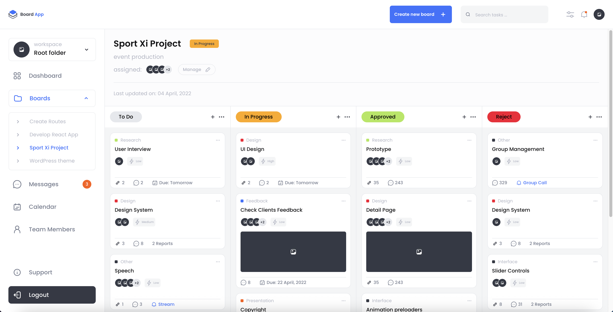

# Board App Dashboard

A pixel-perfect tasks management board built with Next.js 15, Tailwind CSS 4, Zustand, Framer Motion and dnd-kit

Created as a practical test for Visionex Digital



## Features

- Responsive layout (≥ 768 px) with header, sidebar, and swimlane grid
- Drag‑and‑drop between lanes (mouse, pen, touch)
- Smooth slide‑down & stagger animation for board submenu
- Task search with live filtering
- State persisted to local storage
- Mock API routes
- Custom 404 with link back to default board
- Fully typed with TypeScript

## Stack

- Next.js 15
- React 19
- Tailwind CSS 4
- Zustand
- dnd‑kit
- Framer Motion
- Deployed on Vercel

## Quick start

```bash
# 1. Install dependencies
npm install

# 2. Run dev server
npm run dev

# 3. Production build
npm run build
npm start
```
